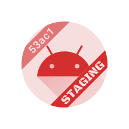

# Android Icon Banner

A Gradle plugin that stamps a corner ribbon onto your Android launcher icon, per build variant.


Install a dev build and a production build on the same device and you cannot tell them apart in the
launcher, in recents, or in app info. Mark the variants you choose; the rest stay untouched.

```kotlin
plugins {
    id("com.android.application")
    id("io.github.bleeding182.iconbanner") version "0.0.1"
}

android {
    flavorDimensions += "environment"
    productFlavors {
        create("staging") { dimension = "environment"; iconBanner { text = "STAGING" } }
        create("prod") { dimension = "environment" }   // production stays untouched
    }
}
```

That is the whole setup. The plugin is on the Gradle Plugin Portal, which every Gradle build already
resolves from, so there is no repository to add — and no imports, no icon assets to maintain. A
variant is bannered only if `text` resolves for it.



Themed (monochrome) icons work too: the band is clipped out of the icon and the text punched through
it as a real cutout, so it stays legible under any tint the system picks. That tint is the same for
the whole icon, so `monochromeAlpha` is what tells two banners apart there.

Requires **AGP 9.3+, Gradle 9+ and JDK 17+**. Vector and bitmap launcher icons both work — see
[Limitations](#limitations) for what a WebP one needs. Applying it to a library or dynamic-feature
module does nothing, so a convention plugin can apply it everywhere.

<br clear="right">

## Options

Style the ribbon once at the `android` level; flavors and build types only say what it reads.

```kotlin
android {
    iconBanner {
        color = "#FF0000"
        textColor = "#FFFFFF"
        corner = topLeft
        maxTextSize = 13
        lineHeight = 1.5
        font = "Roboto Mono"
        weight = 700
    }

    flavorDimensions += "environment"
    productFlavors {
        create("staging") { dimension = "environment"; iconBanner { text = "STAGING" } }
        create("prod") { dimension = "environment" }
    }
}
```

| Property | Type | Default | Notes |
|---|---|---|---|
| `text` | `String`, `Provider<String>`, `null` | unset | Unset means no banner. `null` clears an inherited value. `""` gives an empty ribbon. Rendered verbatim. |
| `color` | `String` | `#FF0000` | A hex literal with optional alpha: `#RGB`, `#ARGB`, `#RRGGBB`, `#AARRGGBB`. The plugin paints the value itself, so nothing it cannot parse is accepted — `?attr/…` included, since a launcher inflates the icon without a theme. |
| `textColor` | `String` | `#FFFFFF` | Same forms. |
| `monochromeAlpha` | `Int` | `100` | How opaque the band is in the themed icon, where the system picks the colour and `color` does not apply. Lower is a lighter shade of the same tint. `0..100`. |
| `corner` | `BannerCorner` | `topLeft` | `topLeft`, `topRight`, `bottomLeft`, `bottomRight`. Two banners overlap unless they sit in *opposite* corners — adjacent ones cross near the middle of the icon. |
| `position` | `Int` | `65` | How far out the ribbon sits: `0` the centre of the icon, `100` the point at which no text fits. Higher is a smaller, tighter tab. `20..95`, and see below. |
| `z` | `Int` | `0` | Paint order where banners overlap: higher goes on top, ties in the order they were declared. |
| `maxTextSize` | `Int` | `13` | Largest the text may be: its cap height as a percentage of the icon's shorter edge. An upper bound — text too long to fit across the ribbon is drawn smaller. `1..21`, past which a launcher's mask would cut into the glyphs. |
| `lineHeight` | `Double` | `1.5` | Band thickness as a multiple of the text's cap height, measured across the band. The band is sized from the text, so this is what makes the ribbon chunkier or tighter; it never changes the text's size or position. `1.0..3.0`. |
| `font` | `String` | `Roboto Mono` | Any Google Fonts family, downloaded on first use and cached. |
| `weight` | `Int` | `700` | Must be a weight the family actually offers. |
| `italic` | `Boolean` | `false` | |

`corner` takes the bare names above in both Kotlin and Groovy, with no import.

**Keep the text short.** The band is sized from the text, but the *length* it has to fit across is
fixed by the icon's mask, so long text is drawn smaller — and a launcher icon is small to begin
with. About seven characters stay comfortably readable, and eleven are legible on a monitor but not
on a phone. Nothing stops you going smaller — raising `maxTextSize` simply will not help, because the
length, not the setting, is what ran out. Latin, left-to-right text only.

### Sizing the ribbon with `position`

The band spans the whole corner, not just its text, so `position` is what decides how big the ribbon
reads. Push a short marker out and it becomes a tight little tab; pull a long one in and it becomes a
broad stripe with room for the text.

It is not free. The text is fitted against the chord across the icon's safe zone, and that chord is
`2r · √(1 − position²)` — flat near the centre, collapsing near the rim:

| `position` | ribbon length | `1A2B3` | `STAGING` |
|---|---|---|---|
| 50 | 64 | 8.1dp | 4.9dp |
| **65** (default) | **58** | **7.1dp** | **4.3dp** |
| 75 | 51 | 6.2dp | 3.7dp |
| 85 | 42 | 4.9dp | 3.0dp |
| 90 | 36 | 4.1dp | 2.5dp |

Lengths are on the 108-unit canvas; the dp figures are cap heights on a stock 48dp launcher slot. Below
about 4dp the text stops being readable on a phone, which is why the longer column runs out first.

So this is fine-tuning, not layout. Going out costs text size quickly and coming in buys very little,
and how much room you have depends entirely on how short the text is: five characters reach about 90
before they stop being readable, while anything the length of `STAGING` is already marginal at the
default and has nowhere to go. Text that no longer fits is simply drawn smaller.

Below 40 the band's inner edge crosses the middle of the artwork, and the ribbon stops reading as a
corner ribbon at all. The range stops at `20..95` because outside it nothing works at any text length.

### Several banners

`banner("name") { … }` declares another banner in the same block. Properties written directly in
`iconBanner { }` are defaults for every banner in scope; each banner overrides what it cares about.

```kotlin
android {
    iconBanner {
        corner = bottomRight              // where the main banner sits
        banner("api") {
            corner = topLeft              // the opposite corner, so the two cannot overlap
            color = "#333333"
            monochromeAlpha = 80          // and a lighter shade in the themed icon, which has no colours
            text = "MOCK"
        }
    }

    productFlavors {
        create("staging") {
            iconBanner {
                text = "STAGING"                       // the main banner's text
                banner("api") { color = "#0055FF" }    // refines the one declared above
            }
        }
        create("prod") {
            iconBanner { banner("api").remove() }      // production keeps its clean icon
        }
    }
}
```

The block's own properties are a banner too, named `main` — the one a build script that has never
heard of `banner()` has been configuring all along. The name is reserved for it.

`text` is the one property that does not fall through from the block to the named banners: a
block-level `text` belongs to `main`, so `banner("api")` draws nothing until something gives it text
of its own. A banner nobody ever gives text to is silently no banner, which is what lets you declare
its style at project level and its text on one flavor. `remove()` is sugar for `text = null`.

### Precedence

Build type beats product flavor beats the project-level block — the same rule AGP uses for
everything else. A `null` only clears the value if nothing higher up assigns one.

```kotlin
android {
    iconBanner { text = "PREVIEW" }                      // every variant, unless overridden
    productFlavors {
        create("staging") { iconBanner { text = "STAGING" } }
        create("prod") { iconBanner { text = null } }     // no banner — unless a build type sets one
    }
    buildTypes {
        named("debug") { iconBanner { text = "DEBUG" } }   // wins over both, prodDebug included
    }
}
```

That chain runs once per banner, and each banner resolves against two tiers of it: its own
`banner("api") { … }` declarations first, then the block-level properties behind them. `text` is the
exception — the block's `text` is the main banner's and never falls through, or every named banner
would repeat it.

### Build metadata in the banner

`text` accepts a `Provider<String>`, so a banner can carry something the build computes — which is
what a second banner is for. The environment goes in one corner, the commit in the other:

```kotlin
val gitSha = providers.exec { commandLine("git", "rev-parse", "--short=5", "HEAD") }
    .standardOutput.asText.map { it.trim() }

android {
    iconBanner {
        corner = bottomRight
        banner("sha") {
            corner = topLeft
            position = 85       // short enough to push out, so it reads as a small tab
            text = gitSha
        }
    }
    productFlavors {
        create("staging") { iconBanner { text = "STAGING" } }
        create("prod") { iconBanner { banner("sha").remove() } }
    }
}
```

Assigning a provider enables the banner even before its value is known. Note the short SHA, and note
that it is a banner of its own: one banner reading `"STAGING 1a2b3"` would be past what stays
readable at icon size.

The value is read when the icon is generated rather than when the build is configured, with one
caveat: under the configuration cache a provider is finalized as the entry is stored, so on builds
where the generate task enters the task graph it resolves during configuration.

## Limitations

- **Bitmap icons come out as PNG.** Legacy raster mipmaps are bannered too, but the JDK can only write
  PNG, so `mipmap-hdpi/ic_launcher.webp` is re-emitted as `mipmap-hdpi/ic_launcher.png` under the same
  resource name. The original is not packaged.
- **A WebP icon pulls in a reader.** The JDK cannot decode WebP, which is the format Android Studio
  generates, so the plugin fetches `com.twelvemonkeys.imageio:imageio-webp` (about 580 KB, cached like
  any other dependency) the first time the JDK itself fails to read one of your bitmaps. Such a project
  needs a repository that serves it; `mavenCentral()` is enough. Declare that coordinate in the
  `iconBannerImageReaders` configuration to pin a different version. The JDK's own readers go first, so
  an icon that is all vectors or all PNG never fetches it and needs no repository for it — though the
  configuration cache resolves the configuration once per stored entry either way. Expect to need it:
  an Android Studio project declares `android:icon="@mipmap/ic_launcher"`, and that resource includes
  `mipmap-*/ic_launcher.webp` for pre-API-26 devices even when the adaptive icon is entirely vectors.
- **Only the icons you declare are touched, and only in the forms you already have.** The plugin reads
  `android:icon` and `android:roundIcon`; an attribute you do not declare names no icon, so an
  `ic_launcher_round` no manifest points at is left alone — Android never loads that one either. No
  density or configuration variant is ever invented: `anydpi` stays `anydpi`, and a missing `ldpi` stays
  missing.
- A nine-patch, or a bitmap no reader can decode, is skipped with a warning. If a variant asks for a
  banner and *nothing* in its icon could take one, the build fails rather than silently shipping an
  unmarked icon.
- **A legacy or plain-vector icon renders about 1.5x smaller.** Sizes are percentages of the icon's own
  edge, and a launcher draws those icons whole where it crops an adaptive icon's layers to a 72dp mask.
  The banner is applied either way; if your icon is a small old bitmap, the banner is small with it.
- The bannered copy overrides the foreground **by resource name**, so anything else pointing at that
  drawable — a splash screen, say — gets the banner too.
- The build fails if the chosen font has no glyph for a character in your text.
- A variant with Android resources disabled gets no banner, with a warning.

## Fonts and licensing

Faces come from Google Fonts at build time and are cached in `~/.gradle/caches/android-icon-banner`.
**No font file is shipped in your app** — the glyphs you use are traced to vector path data and that
path data is what ends up in the icon.

For the OFL-licensed families that most of Google Fonts uses, that means you owe nothing: the licence
is explicit that artwork made with a font is not itself Font Software, and that embedding a font in a
document does not affect the document's licence
([OFL-FAQ 1.1.1 and 1.13](https://openfontlicense.org/ofl-faq/)). No attribution, no notice, and the
Reserved Font Name clause is not engaged, because no derivative font exists.

Some families — those under Apache-2.0 or the Ubuntu Font Licence — have no equivalent carve-out, and
whether traced outlines are a derivative work of the font is genuinely unsettled. If you ship one of
those, the conservative move is to include its notice on your licences screen. Each family's licence
is listed on [fonts.google.com](https://fonts.google.com); the default, Roboto Mono, is OFL.

None of the above is legal advice.

## More

- [How it works](docs/how-it-works.md) — the resource override, geometry, themed icons, font caching.
- [Contributing](CONTRIBUTING.md) — building, the demo app, regenerating these previews.
- [Design notes](specs/icon-banner-gradle-plugin.md) — decisions and the reasoning behind them.

Modelled on a [browser-based banner generator](https://bleeding182.github.io/tools/banner_generator.html)
that produced the same ribbon as copy-pasteable XML.

## License

[MIT](LICENSE). Third-party material is listed in [THIRD-PARTY.md](THIRD-PARTY.md).

Android is a trademark of Google LLC.
